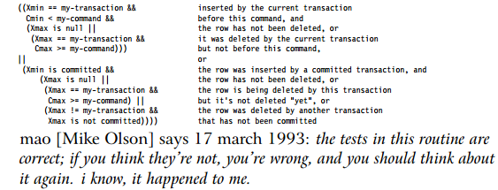

# [Принципы работы СУБД. MVCC](https://habr.com/ru/post/208400/)

__Анализ и проектирование систем, Алгоритмы__

Многие из нас сталкивались в своей работе с СУБД. На текущий момент базы данных в том или ином виде окружают нас повсюду, начиная с мобильных телефонов и заканчивая социальными сетями, в число которых входит и любимый нами хабр. Реляционные СУБД являются наиболее распространенными представителями семейства СУБД, и большинство из них являются транзакционными.
В институте нас заставляли заучивать определение ACID и стоящие за ним свойства, но почему-то стороной обходились подробности реализации этой парадигмы. В данной статье я постараюсь частично заполнить этот пробел, рассказав о MVCC, которая используется в таких СУБД как Oracle, Postgres, MySQL, etc. и является весьма простой и наглядной.

Итак, стоит начать с определения ACID:
- Atomicity — транзакции атомарны, то есть либо все изменения транзакции фиксируются (commit), либо все откатываются (rollback);

- Consistency — транзакции не нарушают согласованность данных, то есть они переводят базу данных из одного корректного состояния в другое. Тут можно упомянуть допустимые значения полей, внешние ключи и более сложные ограничения целостности;

- Isolation — работающие одновременно транзакции не влияют друг на друга, то есть многопоточная обработка транзакций производится таким образом, чтобы результат их параллельного исполнения соответствовал результату их последовательного исполнения;

- Durability — если транзакция была успешно завершена, никакое внешнее событие не должно привести к потере совершенных ей изменений.

Каждое из этих требований выгладит более чем рациональным, особенно если оно затрагивает такие важные сферы, как банковские операции и другие операции с валютой: согласитесь, будет очень неприятно, если с вашего счета деньги спишутся, а на счет магазина они не придут (нарушение «atomicity»), или в результате сбоя АБС будет потеряна информация о том, что вам на счет зачислили зарплату (нарушение «durability»).

Если начать рассуждать о том, как же работают СУБД, поддерживающие ACID транзакции, больше всего вопросов вызовет свойство Isolation: современные СУБД поддерживают сотни и тысячи одновременных транзакций, и все они обращаются к одним и тем же таблицам. Как же сделать так, чтобы они друг другу не мешали? Здесь на помощь приходит MVCC (MultiVersion Concurrency Control), то есть контроль конкурентного доступа к данным через создание множества “версий” изменяемых данных. В упрощенном виде этот механизм можно представить следующим образом: все операции с данными можно условно разделить на чтение (select), вставку (insert), удаление (delete), обновление (update). Вот что происходит при этих операциях:
 - `Select` — считываются валидные записи таблицы. Запись считается валидной, если она создана транзакцией, которая была зафиксирована (`commit`) до начала текущей транзакции;
 - `Insert` — новая запись просто добавляется в свободное место таблицы;
 - `Delete` — запись в таблице помечается как не валидная, при этом сама запись не удаляется;
 - `Update` — комбинация `delete` и `insert`. Сначала старая версия записи помечается как не валидная, затем добавляется новая запись с обновленными данными.

В целом, указанный подход можно реализовать при помощи всего одного дополнительного бита с флагом `is_valid = 1` для валидных записей и `0` для не валидных. Но есть проблема с многопоточностью: при таком подходе будет возможен только последовательный доступ к данным (писатели будут блокировать как читателей, так и других писателей).

Допустим, у нас есть `Таблица А` со следующими данными:

| `Id` | `Value` | `IsValid` |
| ---- | ------- | --------- |
| 1 | Hello | 1 |
| 2 | World | 1 |

И две транзакции, которые пытаются обновить данные следующим образом:
 - Транзакция 1:
    `update A set value = value || 'transaction 1' where ID = 1;`
 - Транзакция 2:
    `update A set value = value || 'transaction 2' where ID = 1;`

Если допустить их параллельную работу на одних и тех же данных, может получиться такой результат:
 - Транзакция 1: прочитала валидное значение `Value` для строки с `ID=1`: “Hello”;
 - Транзакция 2: прочитала валидные значение `Value` для строки с `ID=1`: “Hello”;
 - Транзакция 1: посчитала новое значение для поля `Value`: “Hello transaction 1”;
 - Транзакция 2: посчитала новое значение для поля `Value`: “Hello transaction 2”;
 - Транзакция 1: обновила данные таблицы;
 - Транзакция 2: обновила данные таблицы.

Вот результат такого сценария:

| `Id` | `Value` | `IsValid` |
| ---- | ------- | --------- |
| 1 | Hello | 0 |
| 2 | World | 1 |
| 1 | Hello transaction 1 | 0 |
| 1 | Hello transaction 2 | 1 |

А вот результат их последовательного выполнения:
| `Id` | `Value` | `IsValid` |
| ---- | ------- | --------- |
| 1 | Hello | 0 |
| 2 | World | 1 |
| 1 | Hello transaction 1 | 0 |
| 1 | Hello transaction 1 transaction 2 | 1 |

Очевидно, что требование изоляции нарушено: работающие одновременно транзакции повлияли друг на друга. Подобные ошибки можно условно разделить на Dirty Reads, Non-repeatable Reads и Phantom Reads.
Таким образом можно заключить, что:
 - Одного флага валидности недостаточно, нужен более сложный механизм;
 - Для некоторых типов операций необходимы блокировки. Если две транзакции пытаются обновить одну и ту же запись таблицы, вполне очевидно, что сделать они могут это только последовательно.

Рассмотрим как это работает в Postgres:
1. Все транзакции в системе имеют последовательные номера (условно, по факту номер транзакции для каждой из таблиц свой и в рамках vacuum он сбрасывается во избежании переполнения 4-байтового целого, которое используется для хранения ID транзакции);
2. Существует глобальный реестр транзакций, содержащий информацию о том, какие транзакции находятся в процессе выполнения, а какие были подвергнуты откату;
3. Для каждой записи таблицы существуют технические поля Xmin и Xmax, хранящие информацию о транзакциях, модифицировавших эту запись. Xmin — идентификатор транзакции, которая добавила запись в таблицу. Xmax — идентификатор транзакции, удалившей запись из таблицы;
4. Для каждой записи таблицы существуют технические поля Cmin и Cmax, использующиеся для обеспечения работы транзакций в несколько команд.

Допустим, транзакция сначала добавляет в таблицу строку, затем её обновляет, затем удаляет. Благодаря Xmin и Xmax до момента фиксации транзакции (commit) все эти операции будут невидимы для внешних транзакций. Но как быть с самой транзакцией, которая свои изменения должна видеть, даже если они противоречат друг другу (сначала запись добавили, затем удалили)? Для этого созданы Сmin и Сmax, работающие во многом аналогично Xmin и Xmax, но в рамках одной конкретной транзакции.

С таким набором метаданных мы намного ближе к реализации ACID, чем с одним флагом валидности. Теперь рассмотрим описанные выше операции в контексте MVCC:
 - `Select` — считываются валидные записи таблицы. Для каждой из записей мы имеем Xmin, Xmax, Cmin, Cmax. Если Xmin больше ID текущей транзакции или находится в списке работающих или отмененных транзакций, запись не валидна. Если Xmax задан и меньше ID текущей транзакции и транзакция с этим ID не находится в списке работающих или отмененных транзакций, запись не валидна. Если Xmin равен ID текущей транзакции, то для проверки валидности записи смотрим на Cmin и Cmax (Cmax должно быть задано, чтобы запись была не валидна). Если Xmax равен ID текущей транзакции, всё с точностью до наоборот. Если указанные выше проверки не сработали, запись валидна. На эту тему есть весьма хороший кусок кода из `src/backend/utils/time/tqual.c` с комментарием автора:
 
 - `Insert` — новая запись просто добавляется в свободное место таблицы, ей проставляется `Xmin` в `ID` текущей транзакции и `Cmin` в `ID` текущей операции в рамках транзакции;
 - `Delete` — запись в таблице помечается как не валидная, при этом сама запись не удаляется. Выполняется это следующим образом: `Xmax` ставится в `ID` текущей транзакции, `Cmax` в `ID` текущей операции;
 - `Update` — комбинация `delete` и `insert`. Сначала старая версия записи помечается как не валидная, затем добавляется новая запись с обновленными данными;
 - `Commit` транзакции выполняется через удаление идентификатора транзакции из списка работающих;
 - `Rollback` транзакции выполняется через пометку идентификатора транзакции как транзакция подверженная откату.

Данная модель работы с транзакциями является упрощенной, так как не охватывает механизм блокировок, а также случаи с распределенными транзакциями. Тем не менее этот подход является общим для многих современных СУБД и его понимание позволит лучше разобраться в том, что же происходит внутри движка СУБД.