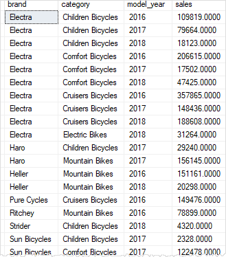

# SQL Server GROUPING SETS

> Summary: in this tutorial, you will learn how to use the SQL Server GROUPING SETS to generate multiple grouping sets.

## Setup a sales summary table

Let’s create a new table named `sales.sales_summary` for the demonstration.

```sql 
SELECT
    b.brand_name AS brand,
    c.category_name AS category,
    p.model_year,
    ROUND(SUM(quantity * i.list_price * (1 - discount)), 0) sales 
INTO sales.sales_summary
FROM sales.order_items i
INNER JOIN production.products p ON p.product_id = i.product_id
INNER JOIN production.brands b ON b.brand_id = p.brand_id
INNER JOIN production.categories c ON c.category_id = p.category_id
GROUP BY
    b.brand_name,
    c.category_name,
    p.model_year
ORDER BY
    b.brand_name,
    c.category_name,
    p.model_year;
```

In this query, we retrieve the sales amount data by brand and category and populate it into the sales.sales_summary table.

The following query returns data from the sales.sales_summary table:
```sql 
SELECT
 *
FROM sales.sales_summary
ORDER BY
 brand,
 category,
 model_year;
```



## Getting started with SQL Server `GROUPING SETS`

By definition, a grouping set is a group of columns by which you group. Typically, a single query with an aggregate defines a single grouping set.

For example, the following query defines a grouping set that includes brand and category which is denoted as (brand, category). The query returns the sales amount grouped by brand and category:

```sql
SELECT
    brand,
    category,
    SUM (sales) sales
FROM
    sales.sales_summary
GROUP BY
    brand,
    category
ORDER BY
    brand,
    category;
```

The following query returns the sales amount by brand. It defines a grouping set (brand):

```sql 
SELECT
    brand,
    SUM (sales) sales
FROM
    sales.sales_summary
GROUP BY
    brand
ORDER BY
    brand;
```

The following query returns the sales amount by category. It defines a grouping set (category):
```sql
SELECT
    category,
    SUM (sales) sales
FROM
    sales.sales_summary
GROUP BY
    category
ORDER BY
    category;
```

The following query defines an empty grouping set (). It returns the sales amount for all brands and categories.

```sql
SELECT
    SUM (sales) sales
FROM
    sales.sales_summary;
```
The four queries above return four result sets with four grouping sets:

```sql
(brand, category)
(brand)
(category)
()
```
To get a unified result set with the aggregated data for all grouping sets, you can use the `UNION ALL` operator.

Because `UNION ALL` operator requires all result set to have the same number of columns, you need to add `NULL` to the select list to the queries like this:

```sql
SELECT brand, category, SUM (sales) sales
FROM sales.sales_summary
GROUP BY brand, category
    UNION ALL
SELECT brand, NULL, SUM (sales) sales
FROM sales.sales_summary
GROUP BY brand
    UNION ALL
SELECT NULL, category, SUM (sales) sales
FROM sales.sales_summary
GROUP BY category
    UNION ALL
SELECT NULL, NULL, SUM (sales)
FROM sales.sales_summary
ORDER BY brand, category;
```


The query generated a single result with the aggregates for all grouping sets as we expected.
However, it has two major problems:

- The query is quite lengthy.
- The query is slow because SQL Server needs to execute four subqueries and combines the result sets into a single one.

To fix these problems, `SQL Server` provides a subclause of the `GROUP BY` clause called `GROUPING SETS`.

The `GROUPING SETS` defines multiple grouping sets in the same query. The following shows the general syntax of the `GROUPING SETS`:

```sql
SELECT
    column1,
    column2,
    aggregate_function (column3)
FROM
    table_name
GROUP BY
    GROUPING SETS (
        (column1, column2),
        (column1),
        (column2),
        ()
);
```

This query creates four grouping sets:

```sql
(column1,column2)
(column1)
(column2)
()
```

You can use this GROUPING SETS to rewrite the query that gets the sales data as follows:
```sql
SELECT
 brand,
 category,
 SUM (sales) sales
FROM
 sales.sales_summary
GROUP BY
 GROUPING SETS (
 (brand, category),
 (brand),
 (category),
 ()
 )
ORDER BY
 brand,
 category;
```

As you can see, the query produces the same result as the one that uses the UNION ALL operator. However, this query is much more readable and of course more efficient.

## GROUPING function

The GROUPING function indicates whether a specified column in a `GROUP BY` clause is aggregated or not. It returns 1 for aggregated or 0 for not aggregated in the result set.

See the following query example:
```sql
SELECT
    GROUPING(brand) grouping_brand,
    GROUPING(category) grouping_category,
    brand,
    category,
    SUM (sales) sales
FROM
    sales.sales_summary
GROUP BY
    GROUPING SETS (
        (brand, category),
        (brand),
        (category),
        ()
    )
ORDER BY
    brand,
    category;
```


The value in the grouping_brand column indicates that the row is aggregated or not, 1 means that the sales amount is aggregated by brand, 0 means that the sales amount is not aggregated by brand. The same concept is applied to the grouping_category column.

In this tutorial, you have learned how to generate multiple grouping sets in a query by using the `SQL Server GROUPING SETS`.